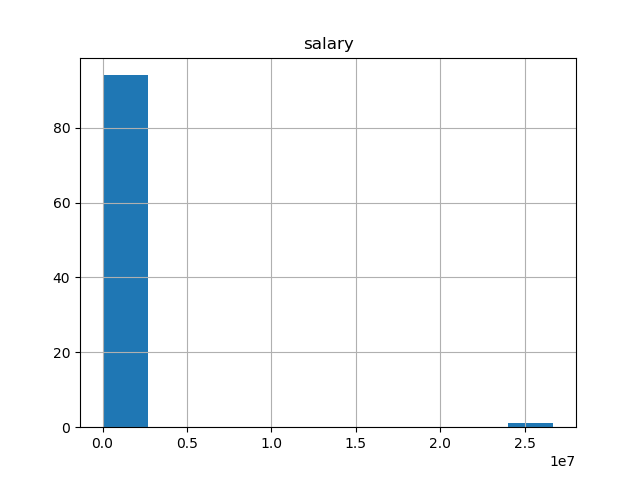
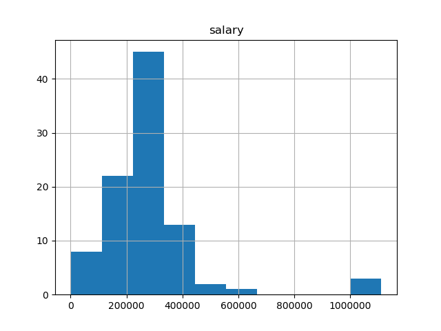

  
# Python Machine Learning Using Enron Data

## Introduction

In December 2012 Enron filed for bankruptcy as one of the largest instances
of corporate fraud in history came crashing down. An investigation followed
and much of the company information became public. The data included over
500,000 emails as well as employee pay and stock information. My goal in
this project is to try to use the data to create an algorithm to identify
people potentially involved in fraud. Machine learning is a good fit for 
this goal as an algorithm can be created and tested on the Enron data and
used in other cases for predicting who could be involved in fraud. Instead
of investigators reading through hundreds of thousands of emails, they could
use an algorithm to find out which people they should focus on in their
investigation.

## Data Exploration

The dataset includes information from 146 employees with 21 features that
fall into 3 different types. The below table lists the features and what type
they are as well as what percentage of the data is not missing. The POI label
denotes whether someone is a 'Person of Interest'. This means that they were 
either indicted, settled, or testified in exchange for immunity. Of the 146 
employees in the dataset there are 18 labeled POI. The machine learning 
algorithm created will try to find what combination of features can correctly 
identify a Person of Interest.

| **Type**      | **Feature**               | **% Not NaN**	|
| ------------- | ------------------------- |---:|
| **Financial** | Salary                    |65%|
|               | Deferral Payments         |27%|
|               | Total Payments            |86%|
|               | Loan Advances             |3% |
|               | Bonus                     |56%|
|               | Restricted Stock Deferred |12%|
|               | Deferred Income           |34%|
|               | Total Stock Value         |86%|
|               | Expenses					|65%|
|               | Exercised Stock Options   |70%|
|               | Other                     |64%|
|               | Long Term Incentive       |45%|
|               | Restricted Stock          |75%|
|               | Director Fees             |12%|
| **Email**     | To Messages               |59%|
|               | Email Address             |59%|
|               | From POI to This Person   |59%|
|               | From Messages             |59%|
|               | From This Person to POI   |59%|
|               | Shared Receipt With POI   |59%|
| **POI**       | POI                       |100%|

For the email features it looks like there is avaialable data for about 
60% of the 146 employees. Some of the financial features aren't as complete,
but that may just be due to the nature of the feature. For example, it could
be that only 3% of employees did take a loan advance and that is why the rest
are NaN. It could be that features with a large amount of NaN values
are actaully good predictors of a POI.

I then looked at which employees had the highest number of features that were
NaN. There was one employee (LOCKHART EUGENE E) who's features were all NaN 
except the POI label. I will remove him from the dataset as we have no data.
I also saw an employee with the name of THE TRAVEL AGENCY IN THE PARK. They
had NaN for all features except 'Other' and 'Total Payments'. It appears that 
this was a company owned by the sister of Enron's former chairman and received
payments from employees for company travel. I will also exclude them from the 
dataset.

Next I looked at a simple histogram of the employee salaries and found a value
of $26,700,000.



This is definitely an outlier and on further investigation I found that the
key is TOTAL. This was just an issue with the data import including a total
row, I removed this from the dataset as well. The new histogram looked much
better.



After removing the three rows and the email address feature the data has been
cleansed and I began engineering and selecting features.

## Feature Engineering and Selection

I first created two new features. I created ratios from the features that 
show the total numbers of emails that a person has sent to or received 
from a POI. The ratios are what percentage of emails a person sent 
were to a POI and what percentage of emails a person received were from a POI.
This will be more comparable accross employees as some employees send a lot of
email and some don't. 

For both feature selection and scaling I will use GridSearchCV to determine
whether scale the features and how many features to use in each algorithm.

I am including StandardScaler in the GridSearchCV so that I can use 
standardized features in algorithms that may be impacted by scaling. For 
example, an SVM or K-Means Clustering algorithm would be impacted by having 
salaries as large as $1 million and numbers of emails in the hundreds. 
GridSearchCV will decide if the data will be scaled or not with each algorithm. 

I will then include SelectKBest to see which features would be most useful in 
the algorithms. The scores of the features are in the table below. GridSearchCV
will choose how many of the features to use in each algorithm. 

| **Feature**	| **Score**	|
| ------------- | --------- |
|exercised_stock_options   | 24.815080|
|total_stock_value         | 24.182899|
|bonus                     | 20.792252|
|salary                    | 18.289684|
|fraction_to_poi           | 16.409713|
|deferred_income           | 11.458477|
|long_term_incentive       |  9.922186|
|restricted_stock          |  9.212811|
|total_payments            |  8.772778|
|shared_receipt_with_poi   |  8.589421|
|loan_advances             |  7.184056|
|expenses                  |  6.094173|
|from_poi_to_this_person   |  5.243450|
|other                     |  4.187478|
|fraction_from_poi         |  3.128092|
|from_this_person_to_poi   |  2.382612|
|director_fees             |  2.126328|
|to_messages               |  1.646341|
|deferral_payments         |  0.224611|
|from_messages             |  0.169701|
|restricted_stock_deferred |  0.065500|

## Algorithm Selection and Tuning

I chose three algorithms to tune, fit, and test. For each algorithm I created
a Pipeline using GridSearchCV that chose whether or not to scale the features,
chose how many features to use, and tuned selected parameters. Below is the
code I used to setup the pipelines and what GridSearchCV output for the best
parameters. It is important to tune the algorithm correclty. The goal is to
maximize the perfromance of a model, but going to far can lead to overfitting.
Thankfully there is help in the form of GridSearchCV which will take inputs
of different values for parameters and try all of the different combinations.

#### GaussianNB
Setup:  
```
pipe = Pipeline([
        ('scaler', StandardScaler()),
        ('selector', SelectKBest()),
        ('classifier', GaussianNB())
    ])
param_grid = {
    'scaler' : [StandardScaler(), None],
    'selector__k': [5, 10, 15, 'all']
}
clf = GridSearchCV(pipe, param_grid, scoring='f1', cv=cv).fit(features,labels)
print clf.best_params_
```
Best Parameters:  
> {'selector__k': 5, 'scaler': None}

The GaussianNB classifier doesn't have any parameters I want to tune, so the 
GridSearchCV is simply choosing to use the top 5 best features and to not scale
the features. 

#### DecisionTreeClassifier
Setup:  
```
pipe = Pipeline([
        ('scaler', StandardScaler()),
        ('selector', SelectKBest()),
        ('classifier', DecisionTreeClassifier())
    ])
param_grid = {
    'scaler' : [StandardScaler(), None],
    'selector__k': [5, 10, 15, 'all'],
    'classifier__splitter' :  ['best', 'random'],
    'classifier__class_weight' : ['balanced'],
    'classifier__max_depth' : [18, 20, 22, None],
    'classifier__min_samples_leaf': [1, 2, 3],
    'classifier__max_leaf_nodes': [7, 8, 9]
}
clf = GridSearchCV(pipe, param_grid, scoring='f1', cv=cv).fit(features,labels)
print clf.best_params_
```
Best Parameters:
> {'classifier__splitter': 'random', 'selector__k': 15, 'scaler': None, 'classifier__class_weight': 'balanced', 'classifier__max_leaf_nodes': 9, 'classifier__min_samples_leaf': 1, 'classifier__max_depth': 22}

For the DecisionTreeClassifier the GridSearchCV again chose to not scale,
but this time chose to use the best 15 features. I also had quite a few
parameters that I wanted to tune. For each parameter I originially used big
ranges and ran it multiple times to narrow down and get the best F1 score
possible.

#### SVC
Setup:
```
pipe = Pipeline([
        ('scaler', StandardScaler()),
        ('selector', SelectKBest()),
        ('classifier', SVC())
    ])
param_grid = {
    'scaler' : [StandardScaler()],
    'selector__k' : [5, 10, 15, 'all'],
    'classifier__gamma' : [0.001, 0.01, 0.1, 1],
    'classifier__C' : [0.001, 0.01, 0.1, 1, 10, 100],
    'classifier__kernel' : ['rbf','sigmoid'],
    'classifier__class_weight' : ['balanced', None]
}
clf = GridSearchCV(pipe, param_grid, scoring='f1', cv=cv).fit(features,labels)
print clf.best_params_
```
Best Parameters:
> {'selector__k': 'all', 'scaler': StandardScaler(copy=True, with_mean=True, with_std=True), 'classifier__class_weight': 'balanced', 'classifier__gamma': 0.01, 'classifier__kernel': 'sigmoid', 'classifier__C': 10}

I then did the SVC classifier. GridSearchCV chose to scale the features and to use
all of them in the algorithm. I again tuend a few parameters to get the best F1 
score possible.

## Validate and Evaluate

For validation I used StratifiedShuffleSplit to split the data into training 
and testing sets. The purpose of this is to make sure that the algorithm 
doesn't overfit on the full set of data and then score high on a test that 
is a portion of the data it was trained on. Without splitting the data
the evaluation scores would appear higher than what will actually happen
when the algorithm is used to predict new data. Cross-validation also 
does the splitting process multiple times. This ensures that the testing 
sample isn't just randomly a sample that matches well to the algorithm. 

The two metrics that I am going to use to evaluate the performance of the algorithms
are precision and recall.

Precision is the number of true positives divided by the true positives plus the 
false positives. If an algorithm has better precision that means that it has 
less false positives, but more false negatives. In the case of the POI classifier 
it will be less likely to identify someone who is not a true POI as a POI. However,
it will be more likely to classify a true POI as not a POI.

${\displaystyle {\text{Precision}}={\frac {tp}{tp+fp}}\,}$

Recall is the number of true positives divided by the true positives plus the false
negatives. If an algorithm has better recall that means that it has less false 
negatives, but more false positives. In the case of the POI classifier it will be 
less likely to identify a true POI as not a POI. It does however identify more 
people who aren't a true POI as a POI. 

${\displaystyle {\text{Recall}}={\frac {tp}{tp+fn}}\,}$

For a POI classifier I think that recall is more important. I want to make sure that
I am not missing any potential POIs. If that means I have a higher amount of false 
positives that would be fine with me. In my opinion, the purpose of the classifier
would be to create a list of suspects to investigate further. If there is a false 
negative a person who should be investigated never would be and that POI may never
be caught. If there is a false negative a person who doesn't need to be investigated
would be, but hopefully the investigation would clear them quickly. Really the whole
purpose of the classifier should be to focus the investigation. 

With that in mind here are the scores from the testing of each classifier.

####  GaussianNB
|			|Score	|
|-----------|---	|
|Precision	|0.41910|     
|Recall		|0.34450|

|n=15,000|Predicted: No|Predicted: Yes|
|---|---|---|---|
|**Actual: No**|12,045|955|
|**Actual: Yes**|1,311|689|

####  DecisionTreeClassifier
|			|Score	|
|-----------|---	|
|Precision	|0.30060|     
|Recall		|0.62450|

|n=15,000|Predicted: No|Predicted: Yes|
|---|---|---|---|
|**Actual: No**|10,094|2,906|
|**Actual: Yes**|751|1,249|

####  SVC
|			|Score	|
|-----------|---	|
|Precision	|0.33859|     
|Recall		|0.76200|

|n=15,000|Predicted: No|Predicted: Yes|
|---|---|---|---|
|**Actual: No**|10,023|2,977|
|**Actual: Yes**|476|1,524|


The GaussianNB classifier was the most precise, when it classified someone as a POI
it was most likely to be true. If the classifier was being used to determine acutal
guilt this would probably be the best to use because it wouldn't be good to say
someone is guilty and punish them when they aren't actually. It would be better
to miss a few guilty people than to punish innocent ones.

However, I wouldn't use the classifier to actually determine guilt. I would use it 
to focus investigation. In this case I would want to choose the algorithm with the
best recall. This was the SVC. In this case it was the least likely to classify
a true POI as not a POI. This is good because it means an investigator would be
less likely to miss an actual POI. 

## Conclusion
I have chose the SVC classifier as my best model. The recall score of .762 means
that 76% of the time a person who is actually a POI will be classified as one.
The relatively low precision score of .33859 means that about 68% of the time a
person who is not a POI is classified as one. I'm fine with that large amount of 
people being misclassified as a POI because they should be eliminated in the 
ensuing investigation.

---
## References
---
https://github.com/udacity/ud120-projects  
https://en.wikipedia.org/wiki/Enron_scandal  
https://docs.gitlab.com/ee/user/markdown.html  
http://scikit-learn.org/stable/user_guide.html  
http://chrisstrelioff.ws/sandbox/2015/06/25/decision_trees_in_python_again_cross_validation.html 
https://en.wikipedia.org/wiki/Precision_and_recall  
https://towardsdatascience.com/beyond-accuracy-precision-and-recall-3da06bea9f6c  